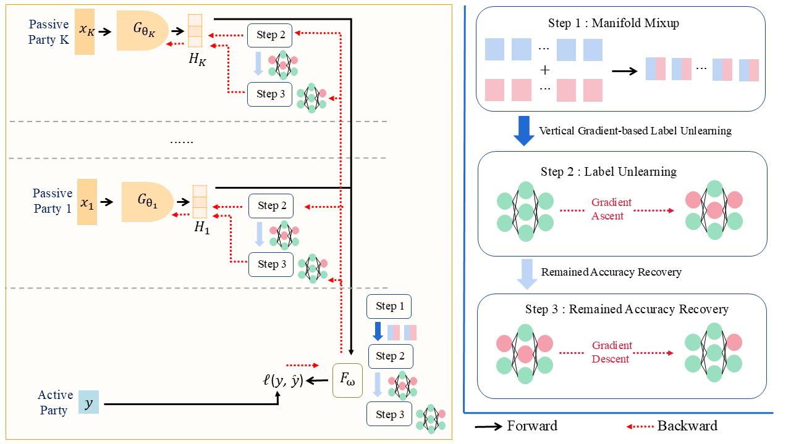

# Federated Label Unlearning

### Official pytorch implementation of the paper: "Towards Privacy-Guaranteed Label Unlearning in Vertical Federated Learning: Few-Shot Forgetting Without Disclosure"

#### ICLR 2026 [(OpenReview)](https://openreview.net/forum?id=G1JdmhkicJ&referrer=%5BAuthor%20Console%5D(%2Fgroup%3Fid%3DICLR.cc%2F2026%2FConference%2FAuthors%23your-submissions)) | [(ArXiv)](https://arxiv.org/abs/2410.10922) | 

#### (Released on February 08, 2026)

## :rocket: Introduction
We tackle label unlearning in Vertical Federated Learning (VFL), where labels are both necessary inputs and sensitive information. We introduce a representation-level manifold mixup to synthesize embeddings for unlearned and retained samples, providing stronger signals for efficient gradient-based forgetting and recovery. Our method removes label information while preserving utility via a lightweight recovery optimization, and scales across diverse datasets (e.g., MNIST, CIFAR-10/100, ModelNet, medical imaging, and Yahoo Answers).

Key Features:
* **Efficiency**: High-speed forgetting via manifold mixup.

* **Utility Preservation**: Lightweight recovery optimization to maintain model performance.

* **Scalability**: Validated on MNIST, CIFAR-10/100, ModelNet, Medical Imaging, and Yahoo Answers.



## :hammer_and_wrench: Getting Start
### 1. Installation

Clone the repository and set up the Conda environment:
```
git clone https://github.com/bryanhx/Towards-Privacy-Guaranteed-Label-Unlearning-in-Vertical-Federated-Learning.git
cd Towards-Privacy-Guaranteed-Label-Unlearning-in-Vertical-Federated-Learning
conda env create -f environment.yml
conda activate unlearn
```


### 2. Dataset Preparation
Download and extract the datasets into a `./data` directory at the project root:

[Brain Tumor MRI](https://drive.google.com/drive/folders/1gFVOAGlUh-sCl-wbDzzrM9G_2UwtMCHB?usp=sharing)

[Yahoo Answer](https://drive.google.com/drive/folders/1Frwb-ozdsDCSwUbGKuXsj5bCbd3hIp8K?usp=sharing)

[ModelNet](https://drive.google.com/drive/folders/14WZ7oaobP4STJkhHDWLHo6LDd9U994FX?usp=sharing)


## :running: Usage
### Phase 1: Training the VFL Model
Train the baseline models or a retrained comparison model:
```
# Standard training
python main.py
```

Train a retrain model in 1 label unlearning scenario:
```
# Retraining
python main.py --mode=retrain
```

You may specify different data with --data=`<data name>`

For ModelNet, please use command below:
```
# Standard training
python main_modelnet.py --data=modelnet --num_classes=40

# Retraining
python main_modelnet.py --data=modelnet --num_classes=40 --mode=retrain
```

### Phase 2: Unlearning
**Note** : Before running unlearning, update the `torch.load()` paths in the unlearning scripts (`unlearn.py`, `unlearn_modelnet.py`, etc.) to point to your saved model weights.

### For all dataset except ModelNet, run following command below:
```
python unlearn.py
```
You may specify specific hyperparameters like data, model architecture, unlearn learning rate, unlearn epochs, and unlearn samples with `--data`, `--model_type`, `--unlearn_lr`. `--unlearn_epochs` and `--unlearn_samples` respectively.

### For ModelNet:
```
python unlearn_modelnet.py --unlearn_method=LUV_modelnet --unlearn_lr=<unlearn learning rate> --unlearn_samples=<samples use for unlearning> --unlearn_epochs=<unlearning epochs>
```

## Citation

```bibtex
@InProceedings{Hong_2026_ICLR,
    author    = {Gu, Hanlin and Tae, Hongxi and and Fan, Lixin and Chan, Chee Seng},
    title     = {Towards Privacy-Guaranteed Label Unlearning in Vertical Federated Learning: Few-Shot Forgetting Without Disclosure},
    booktitle = {The Fourteenth International Conference on Learning Representations (ICLR)},
    year      = {2026}
}
```
## Feedback
Suggestions and opinions on this work (both positive and negative) are greatly welcomed. Please contact the author by sending an email to
`taehongxi55 at gmail.com` or `cs.chan at um.edu.my`

# License and Copyright

The project is open source under BSD-3 license (see the `LICENSE` file).

©2026 Universiti Malaya.


